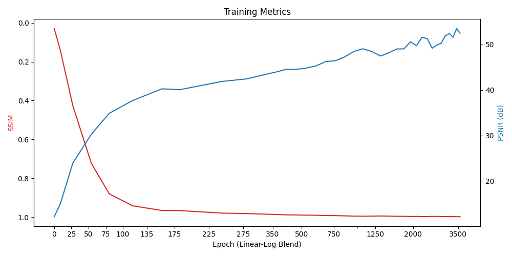
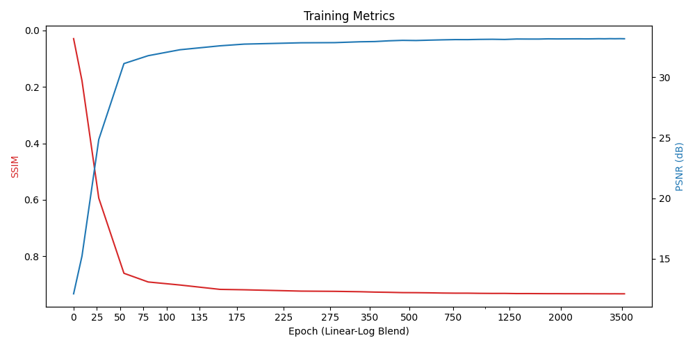
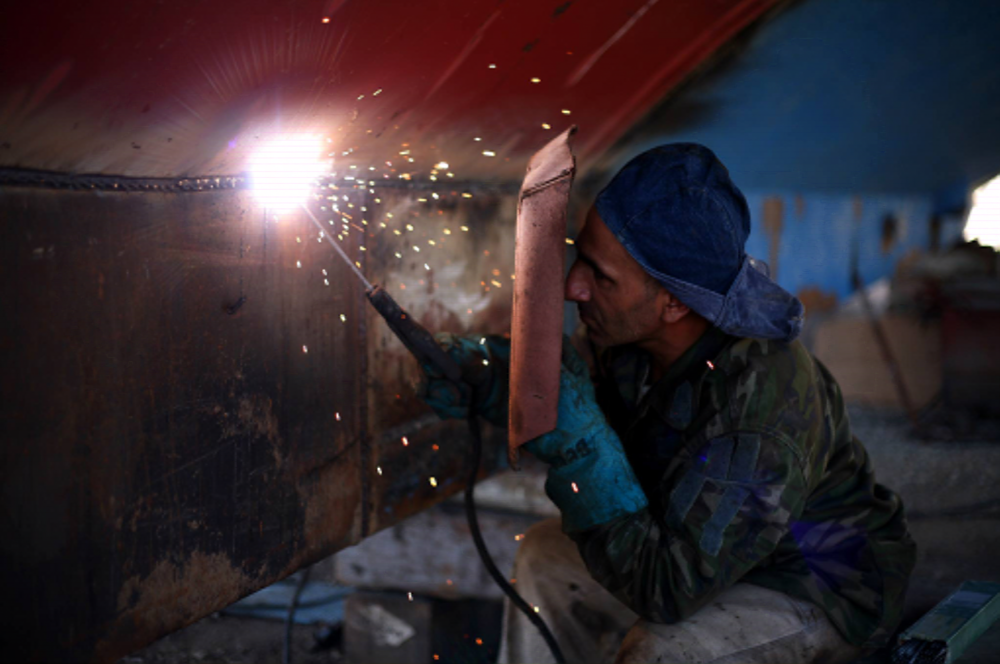
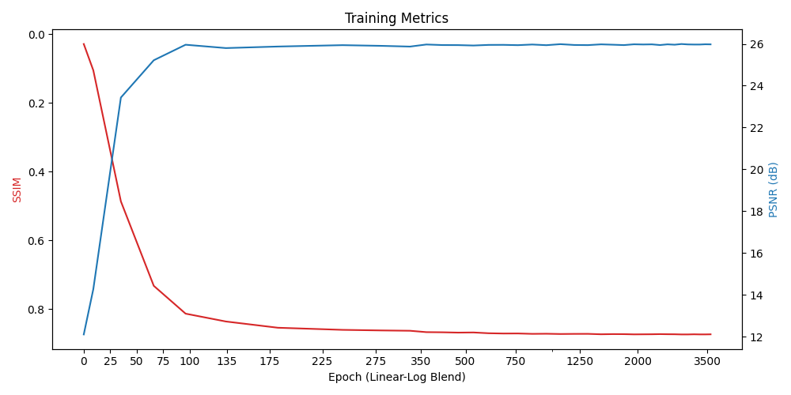
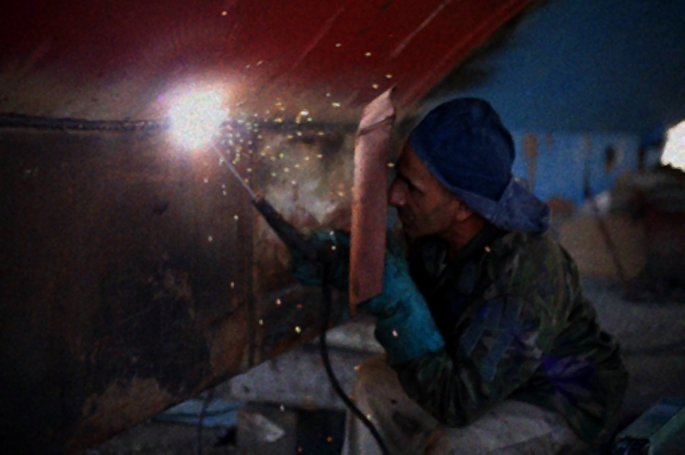
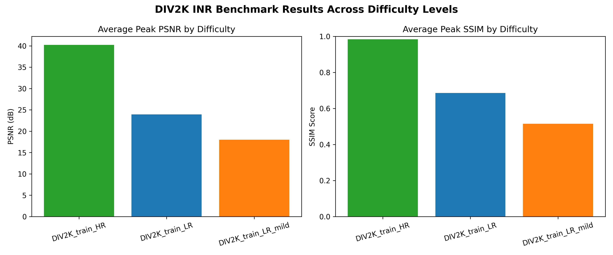

# Results & Benchmarks

## **Div2K Benchmark**
Usually, a standard machine learning model looks at a big dataset of images to learn what an image is (e.g. image of dog, image of cat etc...). But **INRs don't learn some general rule** to apply everywhere; instead, they **learn  one specific image** (quickly) at a time by **mapping X and Y coordinates directly to colors**.

### Why test it on a dataset like DIV2K?
Because DIV2K is packed with a **huge range of images** from sharp text and brick walls to soft feathers, blurry backgrounds and also features both color and black and white images. 
The full DIV2K library can be found [here](https://data.vision.ee.ethz.ch/cvl/DIV2K/).

By testing on this library, we can see exactly how well the architecture handles different types of **visual complexity**.

### Methodology
For our tests, we start by **regenerating the base High Resolution images** (`DIV2K_train_HR`) at the same resolution (2K). 

We also downscaled the HR images 4 times using Windows' Fant algorithm, creating a 'custom library' (`DIV2K_train_LR`). For these images, we attempt to **upscale them back to 2K resolution (4x)** and measure performance by calculating **PSNR and SSIM** against the Ground Truth (GT) original images.

Finally, we also try our luck by attempting to upscale the images from the mild degradation folder (`DIV2K_train_LR_mild`). Our network is not built to perform well on these degraded images, so this serves as a good **lower bound of performance** for the model.

---

### Graphs
These are the results of the DIV2K benchmark 
(In this case specifically `image 0507` which was one of the best onces we had)
| Graph | Output Image |
| :---: | :---: |
| Remake at 2K | PSNR: 52.4809 \| SSIM: 0.9977 |
|  |  |
| 4x upscale | PSNR: 33.1656 \| SSIM: 0.9327 |
|  |  |
| mild degradation 4x Upscale | PSNR: 25.9767 \| SSIM: 0.8730 |
|  |  |

### Metrics

| difficulty_set | Mean Peak PSNR (dB)  | Mean Peak SSIM | Mean MSE | Mean Final Cost |
| :---           | :---                 | :---           | :---     | :---     |
| DIV2K_train_HR | 40.205143            | 0.984387       | 0.000150 | 0.018271 |
| DIV2K_train_LR | 23.936268            | 0.685806       | 0.005407 | 0.258389 |
| DIV2K_train_LR_mild | 18.012891       | 0.515335       | 0.019583 | 0.225078 |

A complete CSV of all metrics for the DIV2K library can be found [here.]("..\DATA\Metrics\all_images_detailed.csv")

---

## **General Metrics Summary**
### Performance based on activation and encoding
| Encoder Type | Activation | Hidden Layers | PSNR (dB) | SSIM | Convergence Speed |
| :--- | :--- | :--- | :--- | :--- | :--- |
| **Grid Encoding** | FINER | 256 × 256 | WIP | WIP | 3500 |
| | SIREN | 256 × 256 | WIP | WIP | 3500 |
| | WIRE | 256 × 256 | WIP | WIP | 3500 |
| **Gaussian PE** | FINER | 256 × 256 | WIP | WIP | 3500 |
| | SIREN | 256 × 256 | WIP | WIP | 3500 |
| | WIRE | 256 × 256 | WIP | WIP | 3500 |
| **Positional Encoding** | FINER | 256 × 256 | WIP | WIP | 3500 |
| | SIREN | 256 × 256 | WIP | WIP | 3500 |
| | WIRE | 256 × 256 | WIP | WIP | 3500 |
| **Base** | FINER | 256 × 256 | WIP | WIP | 3500 |
| | SIREN | 256 × 256 | WIP | WIP | 3500 |
| | WIRE | 256 × 256 | WIP | WIP | 3500 |

---

## **Visual Outputs**

### **Image Reconstruction vs Spatial Gradients**
| Standard RGB Render | Spatial Gradient (Delta x, Delta y) | Target Ground Truth |
| :---: | :---: | :---: |
| `` | `` | `` |